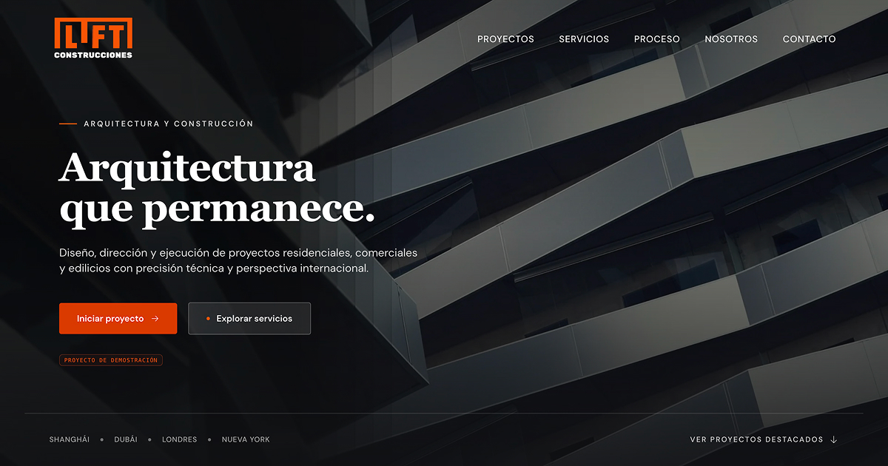

# Lift Construcciones

> Experiencia digital editorial y arquitectónica para una constructora contemporánea. Caso de estudio y proyecto conceptual para el portfolio profesional de **Vorello Agency**.

[](https://astro.build)
[](https://www.typescriptlang.org/)
[](https://tailwindcss.com/)
[](https://www.w3.org/WAI/standards-guidelines/wcag/)
[](LICENSE)
🌐 **Demo en vivo:** [lift-demo.vorelloagency.com](https://lift-demo.vorelloagency.com)

<p align="center">
  
</p>

---

## 1. Propósito del Proyecto

**Lift Construcciones** es una experiencia digital creada para demostrar un estándar elevado de ingeniería frontend, dirección de arte digital, arquitectura de la información y accesibilidad.

El proyecto concibe a una constructora enfocada en desarrollos residenciales, comerciales, edilicios y de uso mixto, abordando el producto desde una estética **sobria, editorial y arquitectónica**, donde la fotografía, la escala material y la planimetría técnica son las protagonistas.

> **Aviso de transparencia:** Proyecto conceptual diseñado y desarrollado con fines demostrativos para portfolio profesional. No representa a una entidad comercial activa.

---

## 2. Puntos Clave de Ingeniería & UX

### 🏛️ Dirección Visual y Composición Editorial

- **Jerarquía tipográfica:** Uso de escala tipográfica modulada con [DM Sans](https://fontsource.org/fonts/dm-sans) y soporte para tipografías editoriales de acento.
- **Paleta inspirada en materiales constructivos:** Hormigón, piedra, acero, papel y carbón suave, con un color de acento controlado (`lift-orange` y `safety-amber`).
- **Documentación técnica interactiva:** Presentación de planos arquitectónicos (implantación, secciones longitudinales, plantas tipo y volumetrías axonométricas) con memorias descriptivas y visores tipo lightbox.

### ⚡ Rendimiento y Arquitectura Estática (SSG)

- **Zero-JS Overhead por defecto:** El sitio se genera estáticamente mediante **Astro 4**, enviando HTML puro y liviano al navegador.
- **Optimización de imágenes con Sharp:** Cada imagen arquitectónica cuenta con dimensiones explícitas, formatos modernos WebP/AVIF y prevención total de Cumulative Layout Shift (CLS).
- **Precarga de fuentes:** Carga directa en formato WOFF2 sin bloqueo de renderizado inicial.
- **Transiciones de página fluidas:** Navegación SPA instantánea mediante `astro:transitions`.

### ♿ Accesibilidad (a11y) & Motion Design

- **Navegación accesible:** Menú drawer móvil accesible con trampa de foco (`initFocusTrap`), bloqueo de scroll compensado (`toggleScrollLock`) y cierre mediante teclado (`Escape`).
- **Soporte estricto para `prefers-reduced-motion`:** Respeto íntegro a las preferencias del usuario. Cuando `prefers-reduced-motion: reduce` está activo, se desactivan transiciones continuas, parallax y delays, manteniendo intacta la legibilidad y operatividad del contenido.
- **Semántica rigurosa:** Landmarks HTML5, encabezados jerárquicos continuos (`h1` único por página), contrastes validados bajo WCAG 2.2 AA y atributos ARIA de estado (`aria-current`, `aria-expanded`, `aria-controls`, `aria-hidden`).

### 🔍 SEO Técnico y Datos Estructurados

- Metadatos completos por vista (Open Graph, Twitter Card, `canonicalUrl`, `themeColor`).
- Generación automática de sitemap XML (`@astrojs/sitemap`).
- Datos estructurados en JSON-LD (Schema.org) orientados honestamente al caso de portfolio (`Person` y `WebSite`), evitando esquemas comerciales fraudulentos.

---

## 3. Estructura del Repositorio

```text
lift-construcciones/
├── public/                 # Favicons, Web App Manifest y assets públicos
├── src/
│   ├── assets/             # Fotografía arquitectónica, planos técnicos y SVGs
│   ├── components/
│   │   ├── content/        # Tarjetas de proyectos, procesos, servicios y principios
│   │   ├── layout/         # Header (con scrollspy dinámico) y Footer
│   │   ├── project/        # Componentes del template de proyecto (Hero, Meta, Galería, Lightbox)
│   │   └── shared/         # Componentes atómicos (Button, Eyebrow, Campos de Formulario)
│   ├── data/               # Modelado y colección de proyectos (projects.ts)
│   ├── home/               # Secciones de la landing (Hero, Manifiesto, Proyectos, Servicios, Proceso, About, Contacto)
│   ├── layouts/            # Template principal con inyección SEO, tipografías y Schema.org
│   ├── pages/
│   │   ├── index.astro     # Landing principal (navegación por anchors)
│   │   ├── 404.astro       # Página de error 404 personalizada
│   │   └── projects/
│   │       └── [slug].astro # Rutas dinámicas generadas en build time (SSG)
│   ├── styles/
│   │   ├── base/           # Resets, tipografía base y normalización de formularios
│   │   ├── motion/         # Transiciones y overrides para prefers-reduced-motion
│   │   ├── tokens/         # Tokens de diseño (colors.css, typography.css, layout.css)
│   │   ├── utilities/      # Clases utilitarias globales de layout y contenedores
│   │   └── global.css      # Entrypoint modular de estilos
│   └── utils/              # Controladores de UI, gestión a11y, DOM y URLs
├── astro.config.mjs        # Configuración de Astro, Tailwind y Sitemap
├── package.json
└── tsconfig.json           # Configuración TypeScript estricta (astro/tsconfigs/strict)
```

---

## 4. Primeros Pasos

### Requisitos previos

- Node.js `>= 18.17.0`
- Gestor de paquetes recomendado: **pnpm** (`pnpm@8.x` o superior)

### Instalación

```bash
# Clonar el repositorio
git clone https://github.com/tu-usuario/lift-construcciones.git

# Entrar al directorio
cd lift-construcciones

# Instalar dependencias con pnpm
pnpm install
```

### Comandos disponibles

| Comando             | Descripción                                                                            |
| :------------------ | :------------------------------------------------------------------------------------- |
| `pnpm dev`          | Inicia el servidor de desarrollo local en `http://localhost:4321`                      |
| `pnpm build`        | Ejecuta la verificación de tipos (`astro check`) y compila para producción en `./dist` |
| `pnpm preview`      | Previsualiza localmente el build estático generado                                     |
| `pnpm format`       | Formatea el código con Prettier respetando las reglas de Astro y Tailwind              |
| `pnpm format:check` | Verifica el formateo del proyecto en entornos de CI                                    |

---

## 5. Licencia & Créditos

- **Diseño y Desarrollo:** [Vorello Agency](https://vorelloagency.com).
- **Imágenes y Referencias:** Las fotografías y esquemas técnicos se utilizan exclusivamente con propósitos demostrativos y de exploración visual de diseño editorial.
- **Licencia:** Este proyecto se distribuye bajo la licencia [MIT](LICENSE).
